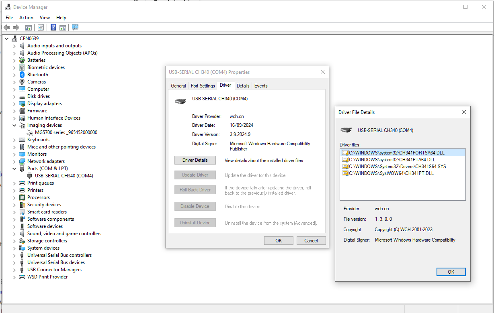

# Getting Started

The ESP32-2432S028 board also known as the "Cheap Yellow Display".
nanoFramework is a version of .Net Framework that allows you to write
code in C# for running on smaller boards and microcontrollers.

[dotNet nanoFramework](https://docs.nanoframework.net)

## Drivers

You should find that the serial port drivers needed for the board to communicate are already installed. You can see this when you open Device Manager.

## Installing NanoFramework Extension

It is possible to develop code for these devices in both Visual Studio and in Visual Studio Code but Visual Studio gives you a better experience with debugging and a device explorer which allows you to flash and check the board.

[Visual Studio Extension](https://marketplace.visualstudio.com/items?itemName=nanoframework.nanoframework-vs2022-extension)

## Hardware

The board includes:

* The display
* Touch Screen
* RGB LED
* General Purpose Input Output
* A light sensor
* WIFI
* SDCard Reader
* Speaker Output

## Firmware

The firmware is installed with a tool called [Nanoff](https://github.com/nanoframework/nanoFirmwareFlasher).

## Packages and Versions

Some of the packages come with the firmware, others you can get from Nuget in the usual manner.
There is a custom version of the display driver Ili9341 which is needed if you want to draw text on the screen as otherwise this would be mirrored. Hope to get this into the upstream driver on Nuget.

## Examples

Current examples include:

* Blinking an LED (on the back of the board) - This could me modified if you want to turn something on or off via the external GPIO
* Fading an LED -This could be modified to drive a servo from the external GPIO
* Display blocks - Basic screen setup and manipulation. Note the colour order of BGR rather than RGB.
* Display Font and Graphics - Fonts are created using the [TinyFontToolGUI tool](http://informatix.miloush.net/microframework/Utilities/TinyFontTool.aspx) and Graphics can be converted using a number of different websites including https://javl.github.io/image2cpp/ with the setting of "Horizontal 2 bytes per pixel", This definately 

