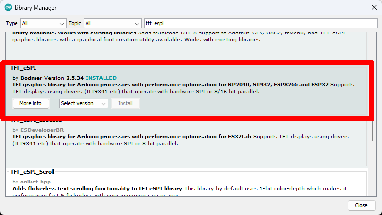
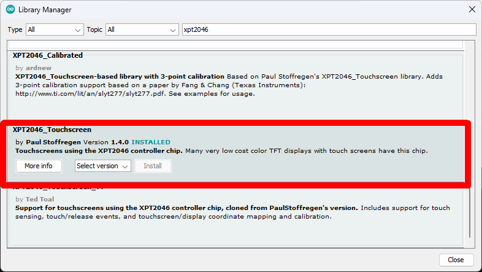
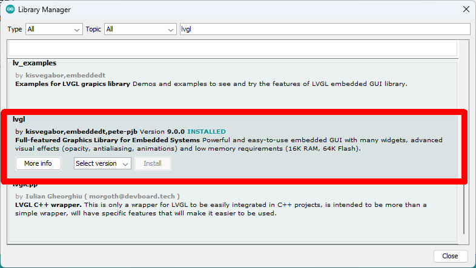

# LVGL examples

[LVGL](https://lvgl.io/) is a popular library for creating user interfaces on resource constrained devices like the ESP32.

This example is the same as [LVGL9](../../LVGL9) but is modified to work with versions of the CYD that have a capacitive touch screen. It uses the [bb_captouch](https://www.arduino.cc/reference/en/libraries/bb_captouch/) library to handle touch screen inputs instead of the XPT2046_touchscreen library for resistive touch screens. 

This has been tested with:

- Arduino IDE v1.8.19 on Windows 11
- [ESP32 Arduino Core](https://docs.espressif.com/projects/arduino-esp32/en/latest/installing.html) v2.0.14
- TFT_eSPI v2.5.34, already configured and tested against the CYD
- bb_captouch v1.0.2, already configured and tested against the CYD
- LVGL version v9.0.0

## Installation

To be able to use the LVGL examples and demos in this repo with the Arduino IDE, take the following steps.

- Install TFT_eSPI from the Arduino Library Manager and [make sure your display works with the examples](https://github.com/witnessmenow/ESP32-Cheap-Yellow-Display/blob/main/SETUP.md), as described elsewhere in this repo.

- Install bb_captouch from the Arduino Library Manager and [make sure your touchscreen works](https://github.com/witnessmenow/ESP32-Cheap-Yellow-Display/tree/main/Examples/capacitive/Basics/2-TouchTest)

- Install LVGL from the Arduino Library Manager, search for 'lvgl' and install the one marked. Note this is version 9.0.0, these instructions may not work with other versions, especially later ones. See other examples for other versions.

- **Do not** install 'lv_examples' from the Arduino Library Manager, it is for older versions of LVGL than 8.3.x.
- **Do not** install 'lv_arduino' from the Arduino Library Manager, it is a different port of lvgl than the one this example works with.

- Copy **lv_conf.h** from the folder "**/ESP32-Cheap-Yellow-Display/Examples/LVGL9/**" in this repository to the Arduino 'libraries' folder. Do not place it in the LVGL library folder, place it in the folder 'above' that which is the container for all of your Arduino library folders. See the [Arduino documentation](https://docs.arduino.cc/software/ide-v1/tutorials/installing-libraries) for help in locating the 'libraries' folder as it can vary between systems. Yes, this is an unusual step but it is necessary.

- Within the LVGL library directory **move the 'examples' directory into the 'src' directory**. This is due to a limitation of the Arduino IDE build system compared to other build systems used by LVGL. You will need to repeat this process if you reinstall or change the version of LVGL. Yes, this is an unusual step but it is necessary.

- Within the LVGL library directory **move the 'demos' directory into the 'src' directory**, as above.

## Choosing an example

The LVGL examples are not separate sketches, they are function calls you uncomment inside the single example sketch. Uncomment one line at a time and compile and upload the sketch again to see each example or demo. The build process for LVGL is quite long as it's a large library.

- Lines 121-179 are examples of a particular style of widget. Some are animated or mildly interactive.
- Lines 182-184 are more complete demos with multiple widgets of various types. The benchmark demo does a benchmark.

The sketch comes with the 'lv_demo_widgets' demo ready to go.

Not all of the examples/demos mentioned in the LVGL docs work, but the ones that do are included in the sketch for you to uncomment and try.

## Disabling example/demo compilation

Once you are done with the examples and demos you should probably remove support for them as it will reduce compile time.

To do this, edit 'lv_conf.h' in the Arduino 'libraries' folder and change '#define LV_BUILD_EXAMPLES 1' to '#define LV_BUILD_EXAMPLES 0' and '#define LV_USE_DEMO_WIDGETS 1' to '#define LV_USE_DEMO_WIDGETS 0'.

See the LVGL documentation for proper detail on what this involves, but it is not absolutely necessary.
