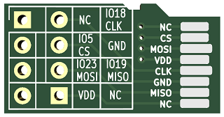

# SD Breakout Card
This is a PCB for breaking out the pins of the MicroSD Card designed by @peteDDD

## What PCB Thickness to order

SD cards are typically 0.75mm thick, but that is not a typical PCB thickness that is offered by the fab houses
According to the author, 1.6mm works fine.
In case of JLCPCB, 1.6mm is the default thickness, so no need to specify anything special - the default will work fine.