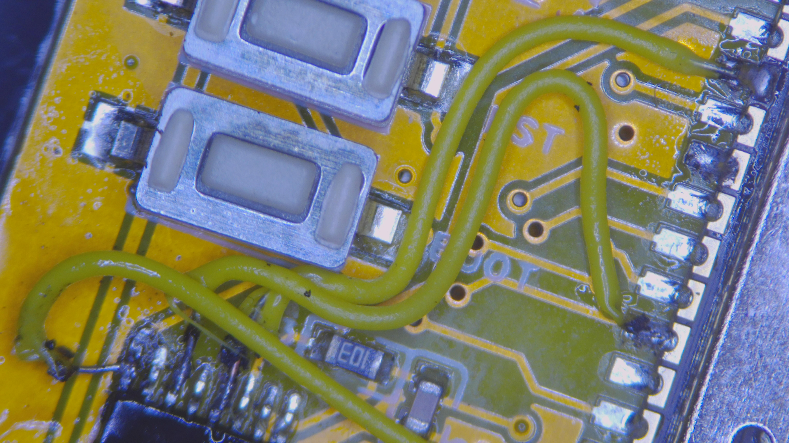
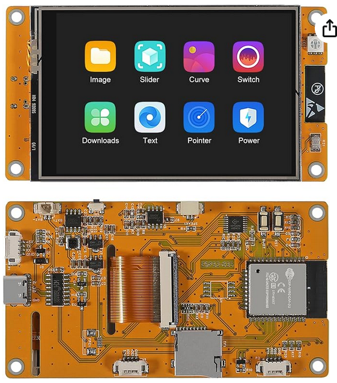

# A no_std Rust Example for the LCD + Touch Controller

This example:

- polls the XPT2046 touch-screen controller in an embassy task
- sends the touch events to another embassy task
- draws a polyline of the touch locations since the start of this touch event
on the LCD.

NOTE: It is not particularly stable or polished, but does work.

## The code its for modified hardware

It was originally written for the hardware in an un-modified form, but the current
commit is for a modified version of the hardware.

### What was modified?

- Lifted XPT2046 sck, din, dout pins and tacked kynar wires over to GPIO22, 26
and 39.

### Why the mod?

- It worked as-shipped, but they reused the same SPI bus for the LCD and touch
XPT2046.  The LCD can run at 80MHz, while the XPT2046 can run at 2.5MHz and that
was severely limiting the screen update performance.

### How to get the code back in alignment with the original hardware?

To go back to the stock hardware and sluggish screen updates, you can use one
embedded_hal_bus::CriticalSectionDevice for the LCD and another for the touch
controller, both given the same embedded_hal::SpiDevice reference.  These will
be used instead of the embedded_hal_bus::ExclusiveDevice instances in the
current code.

## Where to find the device for purchase?

[Amazon linik to device this was tested on](https://www.amazon.com/dp/B0D4VCL6GR?ref=ppx_yo2ov_dt_b_fed_asin_title)

This device doesn't provide documentation.  The pinout doesn't match the
official CYD.  It is a 320*480 LCD with resistive touch-screen with a what
appears to be an ILI9486 controller in BGR565 mode, and an XPT2046 touch
controller.  This is nearly identical to the CYD, other than the larger frame
buffer on the ILI9486 vs the ILI9341 on the official CYD.

I did find the following repository that includes an image of the ESP32 pinout,
though the blue/green LEDs are swapped relative to that image:
[Board support package for Sunton ESP32-3248S035](https://github.com/ardnew/ESP32-3248S035)

## How to convert this for use with the Official CYD?

If you choose to convert/test this on a genuine CYD, I'd recommend making a few
changes to start:

- ILI9486Rgb565 -> ILI9341 (lines 46, 244)
- maybe lower the clock from 80MHz down to 10-20MHz for initial testing
- back light pin 27 -> 21 (lines 119, 220)
- xpt2046 sck 22 -> 25
- xpt2046 mosi 26 -> 32

## Touchscreen Driver

It is a modified version of [tommy-gilligan/touchscreen](https://github.com/tommy-gilligan/touchscreen)

TouchScreen instance no longer owns the LCD.  That wasn't being used in the
crate and I believe it appears there to make way for a future calibration
routine.  This really made it difficult to split the xpt2046 and ili9xxx
instances into separate embassy tasks, which really assists in drawing on the
screen.
