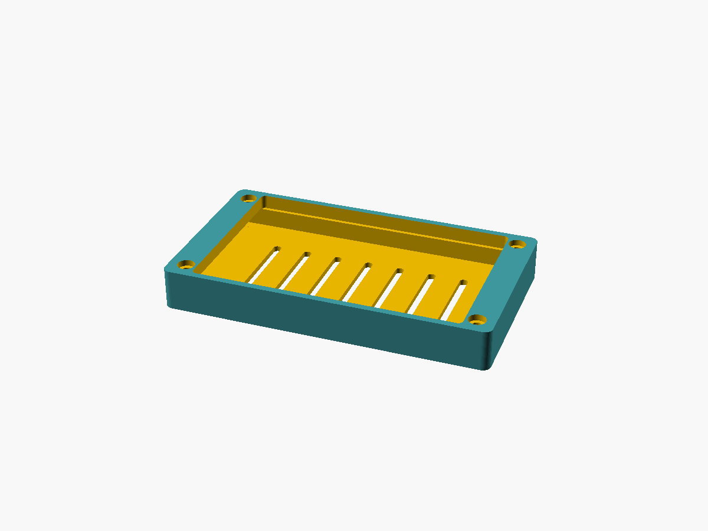
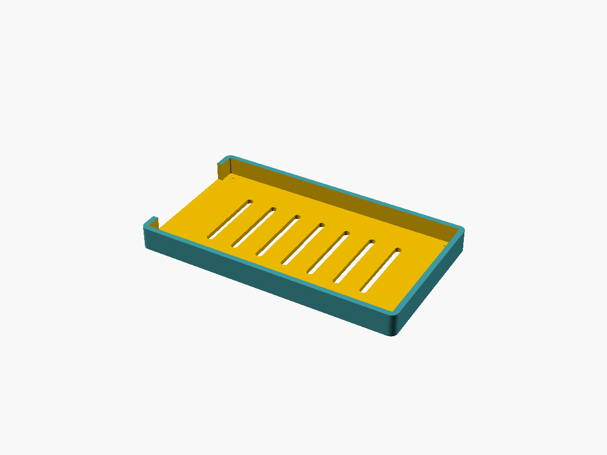
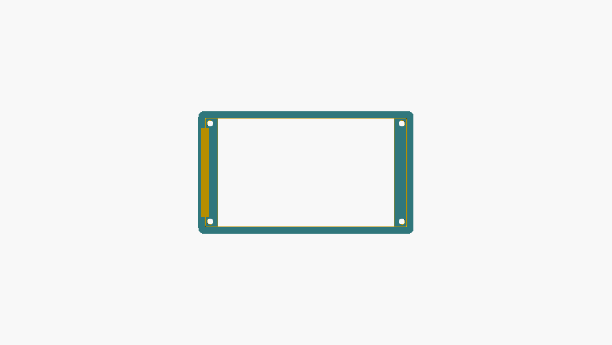

# E32R40T Case (2 parts)

A protective case for the **LCDWIKI E32R40T** (ESP32-32E + 4.0" ST7796 320x480 resistive touch).
All dimensions taken from the official LCDWIKI V1.0 mechanical drawing.

| Exploded | Assembled |
|---|---|
|  |  |
| **Back tray** | **Front bezel** |
|  |  |

## Files
- `e32r40t_case.scad` — **parametric** OpenSCAD source (edit the variables at the top).
- `base.stl` — back tray (holds the PCB and its rear components).
- `bezel.stl` — front frame with the screen window.
- `*.png` — reference renders.

## Regenerate STLs
```bash
openscad -D 'part="base"'  -o base.stl  e32r40t_case.scad
openscad -D 'part="bezel"' -o bezel.stl e32r40t_case.scad
```

## Printing
- **Material:** PLA or PETG. No supports needed.
- **base.stl:** floor down (as oriented).
- **bezel.stl:** window face **down** on the bed for the cleanest visible surface and clean countersinks.
- 0.2 mm layers, 3 perimeters, 20% infill is plenty.

## Assembly
1. Drop the PCB into the base (screen up); the components sit in the rear cavity.
2. Place the bezel on top; the inner lip locates it.
3. Fasten with **4x M3 screws** (self-tapping, ~10-12 mm) from the front: they pass through the
   bezel countersinks, through the PCB mounting holes, and thread into the posts in the base.

## Notes / verify against your board
- The exact position of the USB-C connector along its edge is not dimensioned in the drawing, so
  the opening on that short edge is wide (48 mm, `conn_open_w`) to clear USB-C + RESET + BOOT and a
  cable. Reduce it if you want a tighter fit.
- Check the 4 posts don't foul components near the corners; reduce `post_d` or move them if needed.

## Reference (PCB dimensions, from the LCDWIKI drawing)
PCB 111.11 x 60.88 x 1.60 mm · mounting holes Ø3.2, pattern 104.11 x 53.28 (centered) · glass
94.57 x 60.48 (centered) · touch active area 84.32 x 56.28 · glass protrudes 4.05 mm above the PCB
front face · rear components up to 5.09 mm tall.

---
Designed with OpenSCAD. Contributed by [@chemazener](https://github.com/chemazener).
