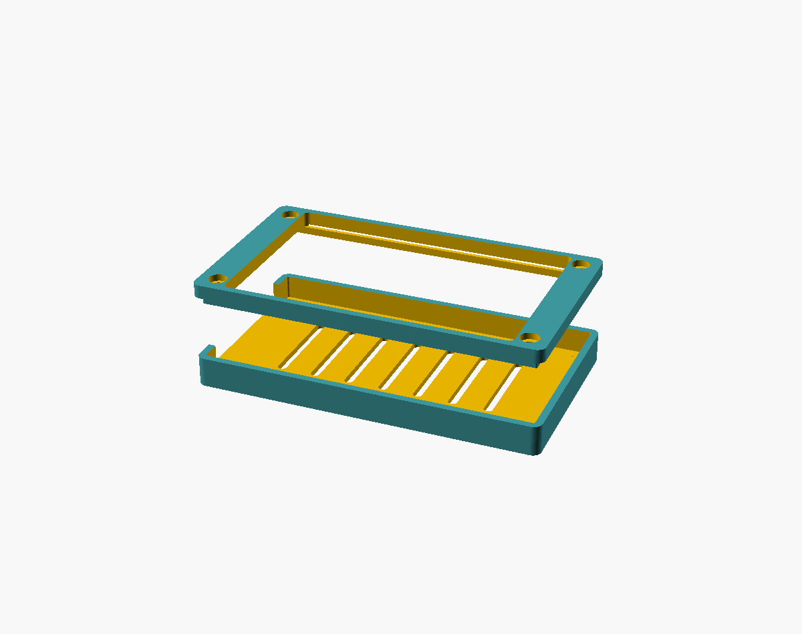

# ESP32-32E 4.0" (LCDWIKI E32R40T)

A 4.0" **320x480** display board using the **ST7796** driver and a resistive touch screen
(**XPT2046**), driven by an ESP32-WROOM-32E. Sold as the "4.0inch ESP32-32E Display" / **E32R40T**.
It is a larger cousin of the CYD (not a CYD): USB-C, microSD slot, RGB LED and several 1.25mm
JST peripheral connectors (speaker, battery, UART, I2C, SPI).

- [AliExpress](https://es.aliexpress.com/item/1005008239809369.html)
- [LCDWIKI product page](https://www.lcdwiki.com/4.0inch_ESP32-32E_Display)
- Official spec / mechanical drawing (PDF): [LCDWIKI E32R40T Specification](https://www.lcdwiki.com/res/E32R40T/E32R40T_E32N40T_Specification_V1.0.pdf)

## PlatformIO / TFT_eSPI config

See the [Variants README](../README.md#esp32-32e-40-lcdwiki-e32r40t) for the full `platformio.ini`
`build_flags`. Key values (verified working):

| Setting | Value |
|---|---|
| Driver | `ST7796_DRIVER` |
| Resolution | 320 x 480 |
| MISO / MOSI / SCLK | 12 / 13 / 14 |
| CS / DC / RST / BL | 15 / 2 / -1 (tied to EN) / 27 |
| Backlight on | HIGH |
| Touch (XPT2046) CS | 33 |

## 3D printable case

A two-part protective case (back tray + front bezel, joined with 4x M3 screws) designed from the
official LCDWIKI mechanical drawing. Files and print/assembly instructions are in
[3dModels/](3dModels/).

